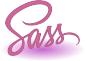
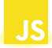
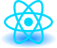
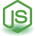
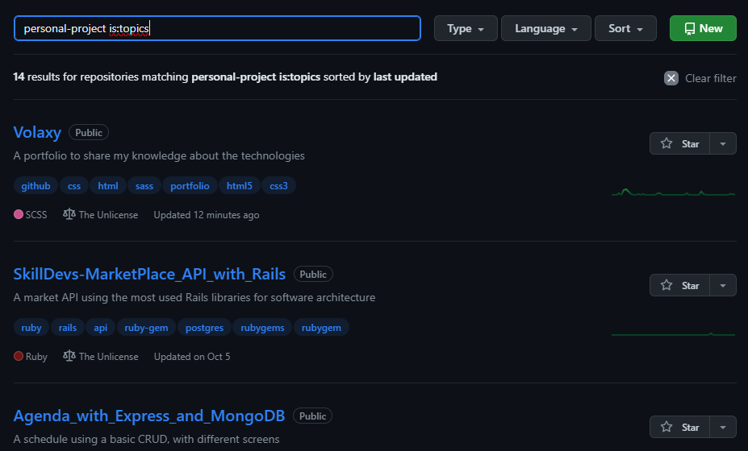

<h1 class="title">
    Gustavo Martins Pereira
</h1>

<h2 class="title">
    ❔ Quem sou eu ❔
</h2>

    
Trabalho e estudo programação há 3 anos, formado na faculdade <a href="https://multivix.edu.br/"
            target="_blank" rel="external">Multivix</a> em <strong>Engenharia da Computação</strong>🔍🖥️, atuo como
        programador <strong><i>Full Stack</i></strong> na empresa <strong>Ancarp</strong>.

    
Meu mantra é sempre conhecer a base da programação (como o <b>JavaScript</b> ❤) para somente depois atuar em
        <i>frameworks</i>, porque para resolver os maiores pepinos que um programador encontrar durante o caminho, é
        preciso um conhecimento muito bem construido em cima da linguagem estudada.

    
Nas horas em que não estou programando eu pratico piano 🎹 e jogo uns jogos aleatórios na Steam.

    

<h2 class="title">
    👨‍💻 Tecnologias que Uso 👨‍💻
</h2>

<h3 class="title">
    🌐 Linguagens e Frameworks 🌐
</h3>

    
    
    
    
    
    
    
    
    

<h3 class="title">
    🛠️ Ferramentas 🛠️
</h3>

    
    
    

<h2 class="title">
    🚢 Navegando pelos Repositórios 🚢
</h2>

Os diretórios estão divididos em subcategorias que são:
* **Course**: Cursos de alguma plataforma, como **Youtube**, **Udemy**, etc.
    * Para cada curso, a plataforma em que o curso foi feito também é categorizada, por exemplo: "Project" como sendo o nome do repositório, com uma tag incluida como **udemy**.
* **Personal-Project**: Projetos pessoais já feitos usando algumas das tecnologias que tenho conhecimento.
* **Course-Project**: Projetos feitos dentro de um curso.

Para pesquisar um repositório com um desses tópicos específicos, digite na barra de pesquisa dos repositórios: 
`SUB-CATEGORY is:topics`, onde no lugar de *SUB-CATEGORY*, você vai escrever o nome da subcategoria, como por exemplo
`course is:topics`, assim aparecerão todos os repositórios que são relacionados aquela tag, conforme exemplo abaixo: 

> Para mais informações de pesquisa de repositórios, acesse essa página da [documentação do
GitHub](https://docs.github.com/pt/search-github/searching-on-github/searching-for-repositories).